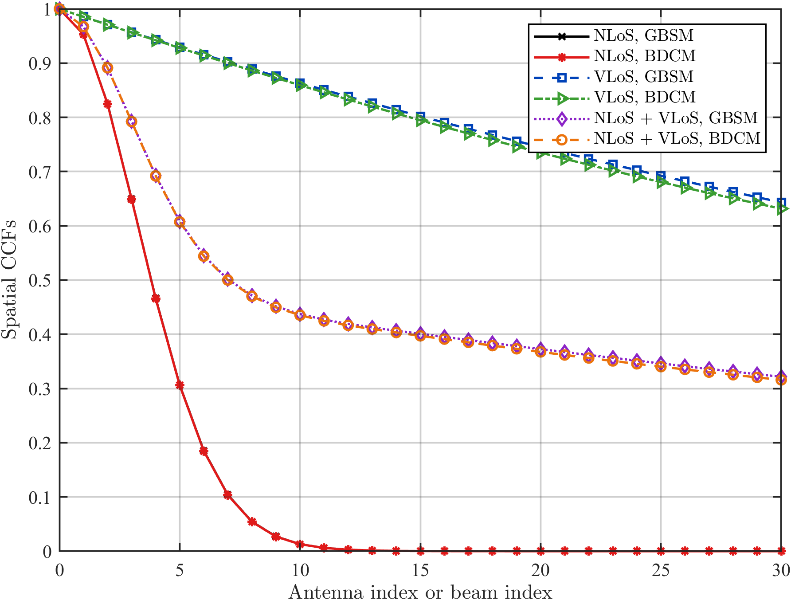
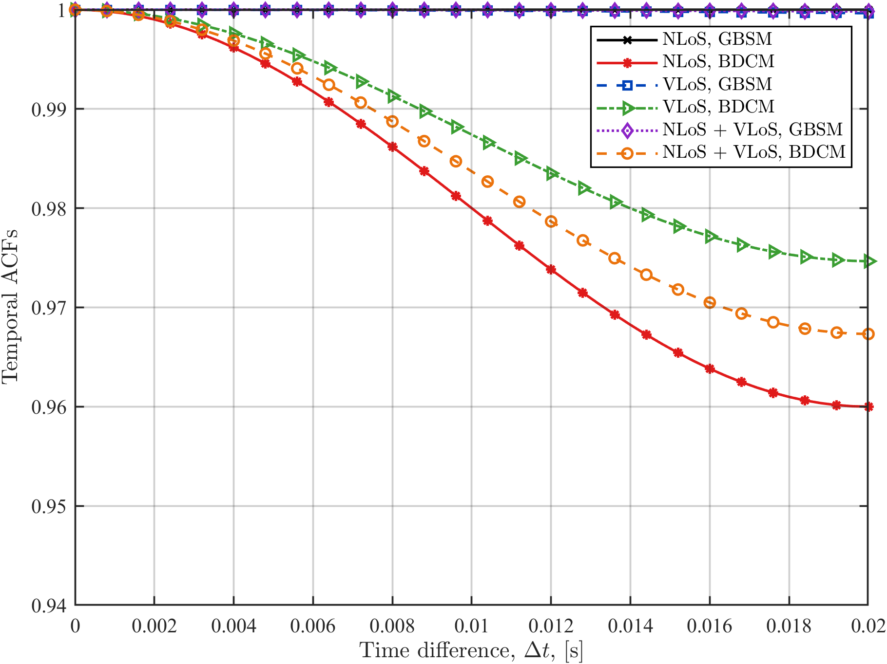
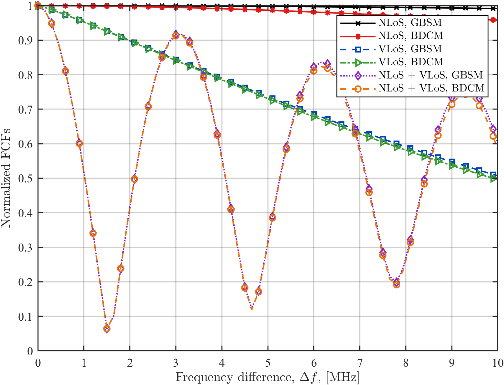
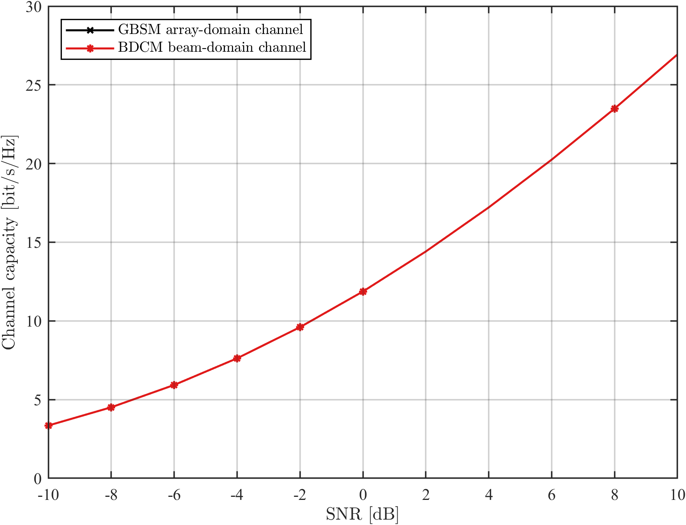
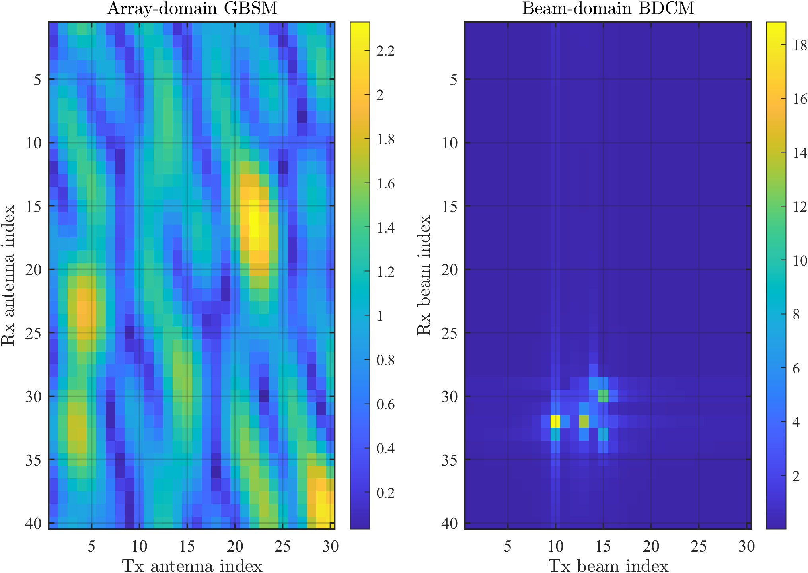
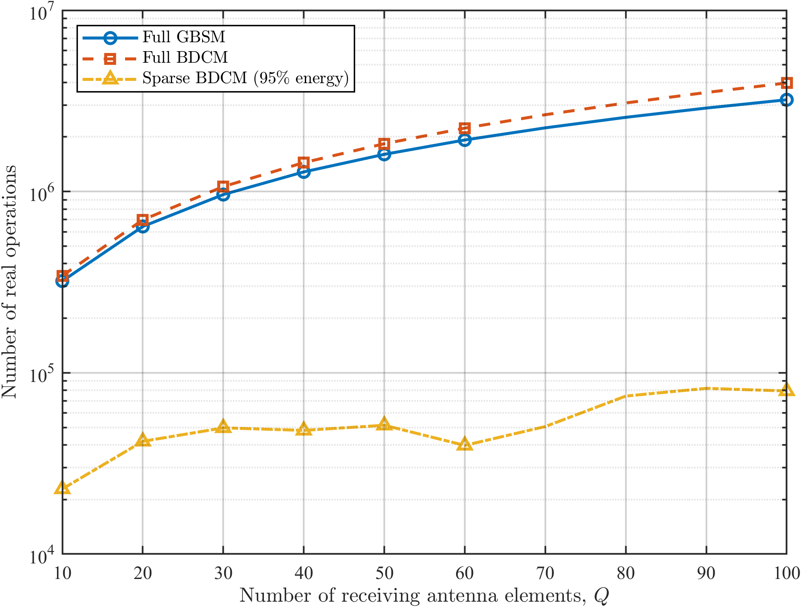
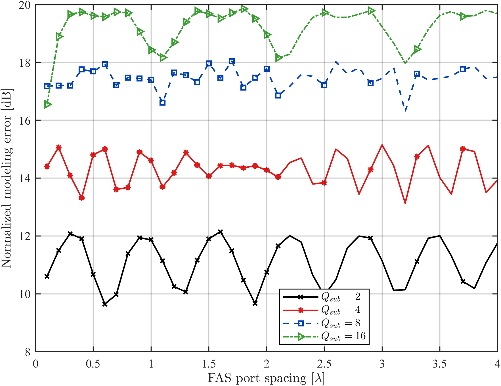
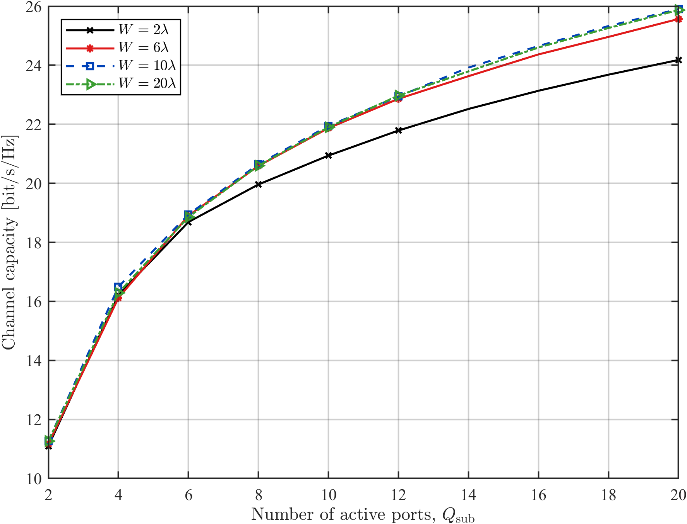
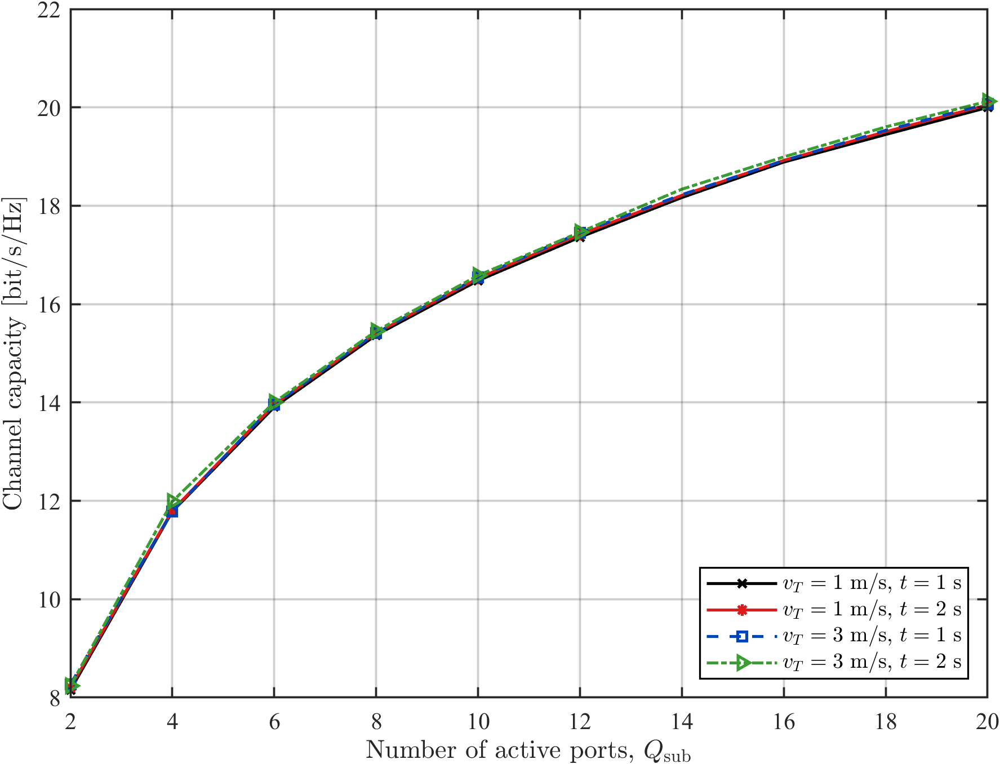
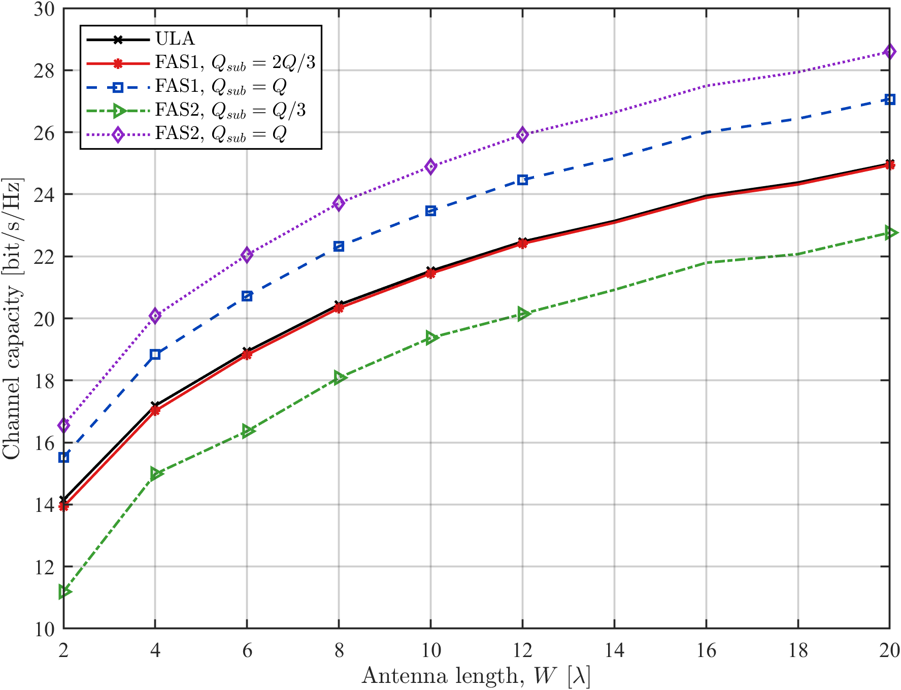

# Reconfigurable Wireless Dynamic Channel Simulator

Self-contained MATLAB platform for dynamic channel modeling and performance
analysis in RIS-enabled V2V and FAS-assisted UAV wireless systems.

## Capabilities

### RIS-V2V

- Spatial cross-correlation, temporal autocorrelation, and frequency
  correlation baselines.
- RIS array-size and element-spacing parameter sweeps.
- Vehicle mobility-state analysis.
- Array-domain and beam-domain capacity invariance check.
- Beam-domain energy concentration and sparsity metrics.
- Equal-basis full-model and sparsity-aware complexity accounting.

### FAS-UAV

- Modeling error versus port spacing and active-port count.
- Capacity versus active ports and physical aperture.
- Capacity under different UAV motion states.
- FAS and conventional ULA capacity comparison.
- Shared random environments for fair Monte Carlo comparisons.
- `quick`, `calibration`, and `final` simulation profiles.

## Repository Layout

```text
.
|-- run_all.m
|-- run_benchmarks.m
|-- run_extensions.m
|-- run_fas_uav.m
|-- run_tests.m
|-- scripts/
|   |-- fas_uav/
|-- src/
|   |-- acf/
|   |-- ccf/
|   |-- fcf/
|   |-- common/
|   |-- config/
|   |-- fas_uav/
|   |-- ris_v2v/
|-- tests/
|-- results/
|   |-- figures/
|   |-- data/
|-- docs/
```

## Requirements

- MATLAB R2024b or a compatible recent MATLAB release.
- No additional MATLAB toolbox is required by the project code.

## Run

From the repository root:

```matlab
run_all
run_tests
```

Individual modules:

```matlab
run_benchmarks
run_extensions
run_fas_uav
```

FAS-UAV uses four Monte Carlo realizations by default for a fast check. For
final-quality figures on PowerShell:

```powershell
$env:FAS_UAV_PROFILE = "final"
matlab -batch "run_all"
matlab -batch "run_tests"
```

The `final` profile uses 300 realizations.

## Selected Results

### RIS-V2V Correlation







### RIS-V2V Beam-Domain Analysis







The ideal DFT transform preserves channel capacity. The complexity reduction
shown by the sparse BDCM curve comes from retaining the beam coefficients that
capture 95% of channel energy, rather than from assigning different matrix
sizes to the full GBSM and BDCM.

### FAS-UAV Analysis









The modeling-error experiment evaluates the complex CIRs directly. Frobenius
normalization is applied separately in the channel-capacity experiments.

## Validation

`run_tests` checks:

- DFT matrix unitarity and ideal capacity invariance.
- FAS-UAV deterministic behavior under fixed random seeds.
- Active-port validity and channel dimensions.
- Raw-CIR and normalized-channel execution paths.
- Modeling-error equation behavior.
- Sparsity and complexity metrics.
- Expected output files and finite numerical values.

The latest release candidate passed both `run_all` and `run_tests` with the
300-realization final profile.

## Documentation

- [Theory notes](docs/theory_notes.md)
- [Run guide](docs/benchmark_run_guide.md)
- [Model validation](docs/model_validation.md)
- [Figure interpretation](docs/figure_interpretation.md)
- [Cross-scenario comparison](docs/cross_scenario_comparison.md)
- [Literature map](docs/literature_map.md)
- [Project roadmap](docs/project_overview_and_roadmap.md)
- [Chinese project description](docs/项目说明书_可重构无线动态信道建模平台.md)

## Research Basis

The implementation is informed by the channel definitions and evaluation
metrics in the RIS-V2V and FAS-UAV publications listed in
[CITATION.md](CITATION.md). The repository contains project code and generated
results only; source papers and internal visual-check materials are not
distributed.

## License

MIT License. See [LICENSE](LICENSE).
